# Microsoft 365 開発者プログラムの登録方法

**※下記情報は2020年9月時点のものです。今後、プログラムの内容や登録方法が変更になる可能性がありますので、その点はご注意ください。**

- [事前準備](#事前準備)
- [Microsoft 365 開発者プログラムへの参加方法](#Microsoft-365-開発者プログラムへの参加方法)
- [Microsoft 365 開発者サブスクリプションのセットアップ](#Microsoft-365-開発者サブスクリプションのセットアップ)
- [関連Webサイト](#関連Webサイト)

---

Microsoft 365では、開発者向けに「[Microsoft 365 開発者プログラム](https://developer.microsoft.com/ja-jp/microsoft-365/dev-program)」が用意されており、このプログラムに参加登録すると、開発者用のMicrosoft 365 E5サブスクリプション(25ユーザーライセンス)を**無料**で取得できます。

このサブスクリプションには**90日間の有効期限**があり、*“サブスクリプションを活用した開発活動を行っている限り”*、自動的に延長されます。

具体的にどのような開発を行っていれば延長されるのかは、Microsoft独自のアルゴリズムによって判定されます。詳細は「[Microsoft 365 開発者プログラムの FAQ](https://docs.microsoft.com/ja-jp/office/developer-program/microsoft-365-developer-program-faq?WT.mc_id=M365-MVP-4029057#how-long-is-my-subscription-good-for-and-when-does-it-expire)」をご参照ください。

## 事前準備
Microsoft 365 開発者プログラムに参加するにあたり、個人用に作成された[Microsoft アカウント](https://account.microsoft.com/account/)、もしくは職場用のアカウントが必要になります(※必要なアカウントの種類については「[Microsoft 365 開発者プログラムの FAQ](https://docs.microsoft.com/ja-jp/office/developer-program/microsoft-365-developer-program-faq?WT.mc_id=M365-MVP-4029057#what-account-can-i-use-to-sign-up-for-the-microsoft-365-developer-program)」をご参照ください)。

Microsoft アカウントをまだお持ちでない方は、「[新しい Microsoft アカウントを作成する方法](https://support.microsoft.com/ja-jp/help/4026324/microsoft-account-how-to-create?WT.mc_id=M365-MVP-4029057)」を参考に、Microsoft アカウントを新規作成してください。

また、プログラム参加時には[SMS](https://ja.wikipedia.org/wiki/%E3%82%B7%E3%83%A7%E3%83%BC%E3%83%88%E3%83%A1%E3%83%83%E3%82%BB%E3%83%BC%E3%82%B8%E3%82%B5%E3%83%BC%E3%83%93%E3%82%B9)を受信するための携帯電話番号が必要になりますので、こちらも事前にご準備ください。

## Microsoft 365 開発者プログラムへの参加方法

1. Microsoft 365 開発者プログラムのサイト( [https://developer.microsoft.com/ja-jp/microsoft-365/dev-program](https://developer.microsoft.com/ja-jp/microsoft-365/dev-program) )を開き、「[参加する](https://developer.microsoft.com/office/profile)」ボタンをクリックします。

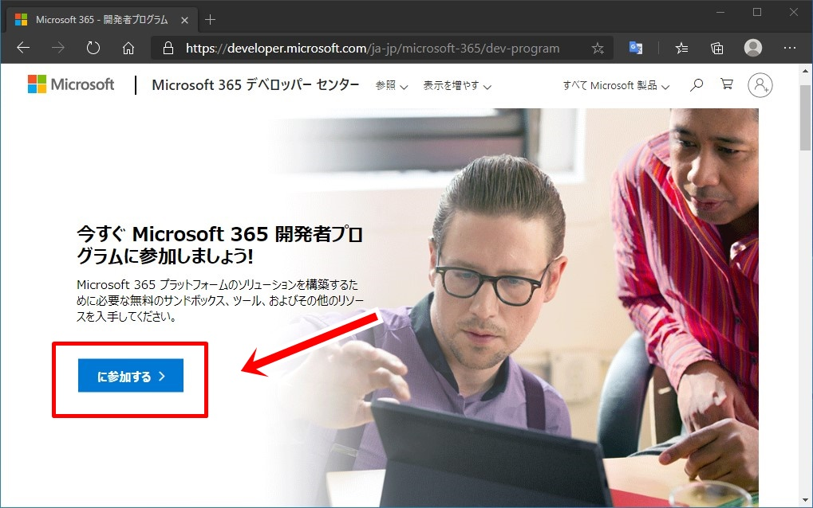

2. [Microsoft アカウント](https://account.microsoft.com/account/)、もしくはAzure Active Directoryが有効化された職場用のアカウントでサインインします。

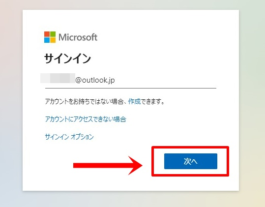
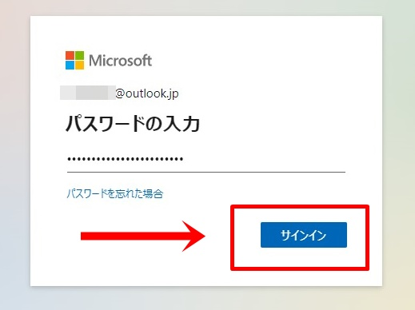
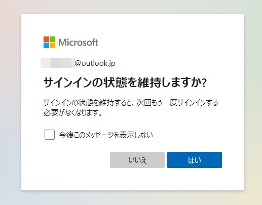

3. 「国/地域設定」、「会社名」、「言語設定」を入力し、[契約条件](https://docs.microsoft.com/ja-jp/office/developer-program/terms-and-conditions)に問題がない場合は同意のチェックを入れ、最後に「次へ」ボタンをクリックします。

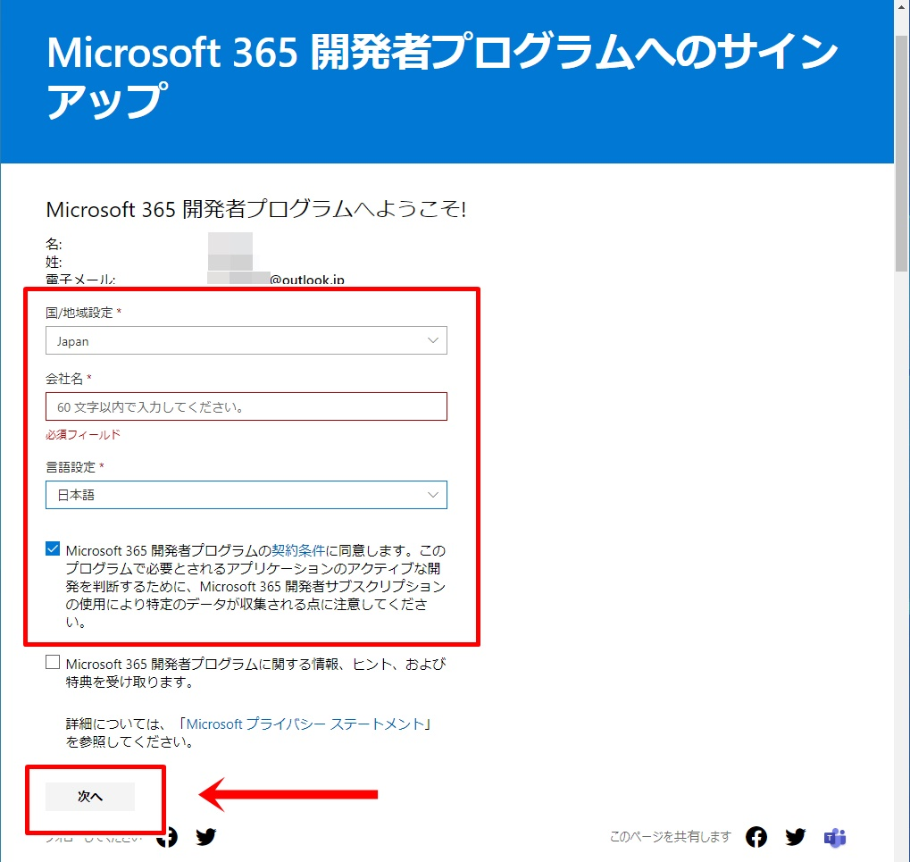

4. 勤めている業界、開発の目的、関心のある分野を選択し、「参加」ボタンをクリックします。

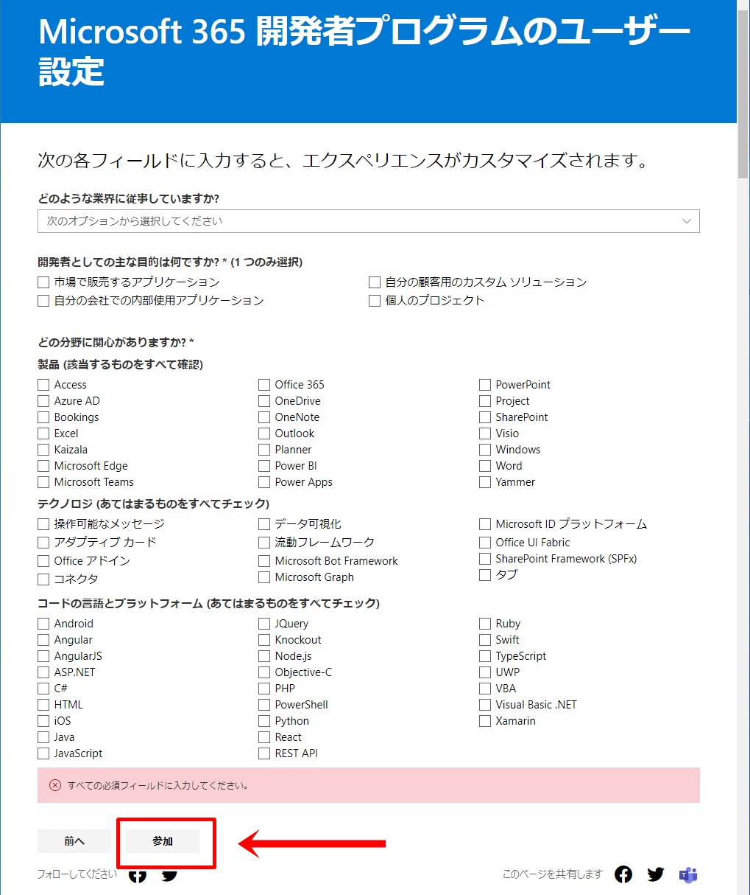

5. 無事に参加登録できると、ウェルカムメッセージが表示されます。

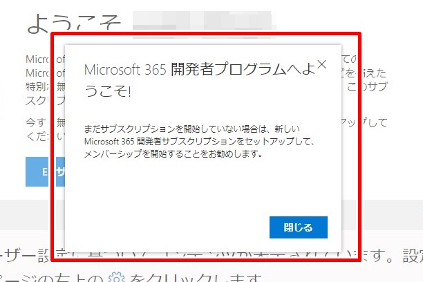

## Microsoft 365 開発者サブスクリプションのセットアップ

1. [Microsoft 365 開発者プログラム](https://developer.microsoft.com/ja-jp/microsoft-365/profile/)のサイトから「E5 サブスクリプションのセットアップ」ボタンをクリックします。

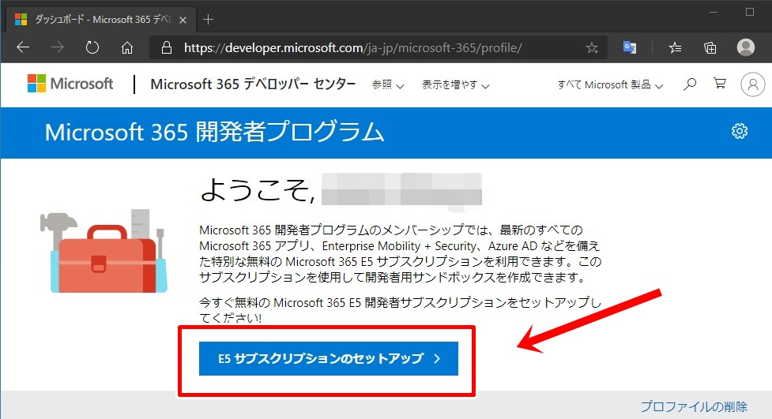

2. 「国/地域設定」、「ユーザー名」、「ドメイン」、「パスワード」を設定後、「続行」ボタンをクリックします。

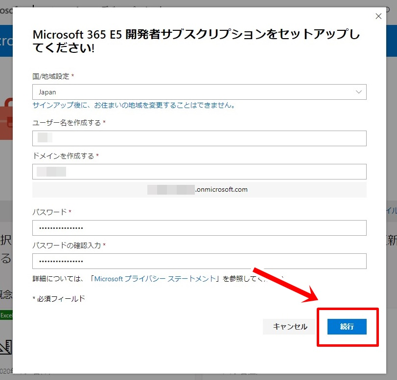

3. ID確認用のコードをSMSで受信するため、SMSが利用可能な携帯電話番号を入力し、「コードの送信」ボタンをクリックします。

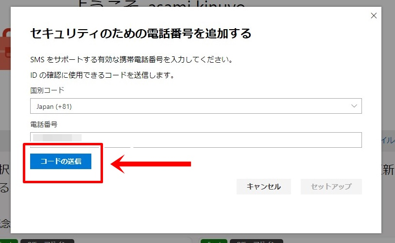

4. SMSで送られてきたコードを入力し、「セットアップ」ボタンをクリックします。

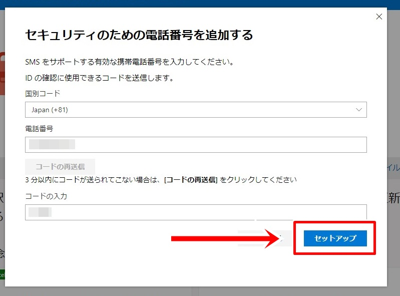

5. セットアップが完了するまで1、2分待ちます。

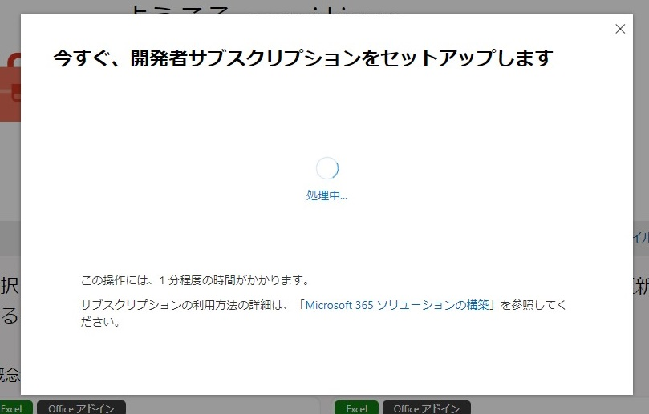

6. Microsoft 365 開発者サブスクリプションが画面に表示されればセットアップ完了です。

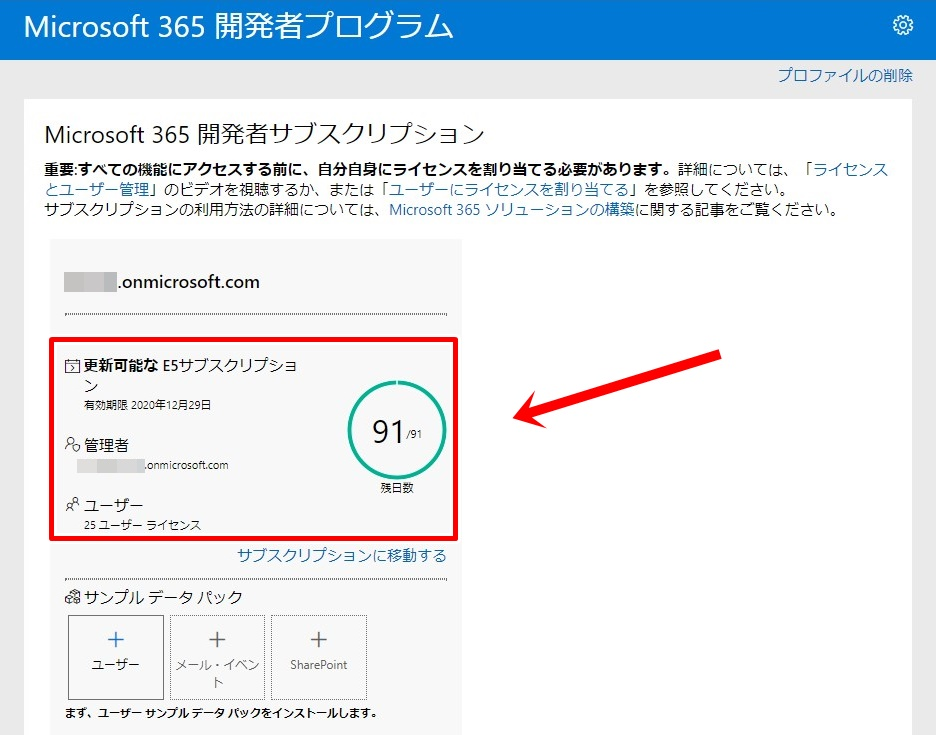

7. サインイン画面( [https://www.office.com/login](https://www.office.com/login) )からセットアップしたアカウントでサインインすると、Microsoft 365のサービスが利用できるようになっていることが確認できます。

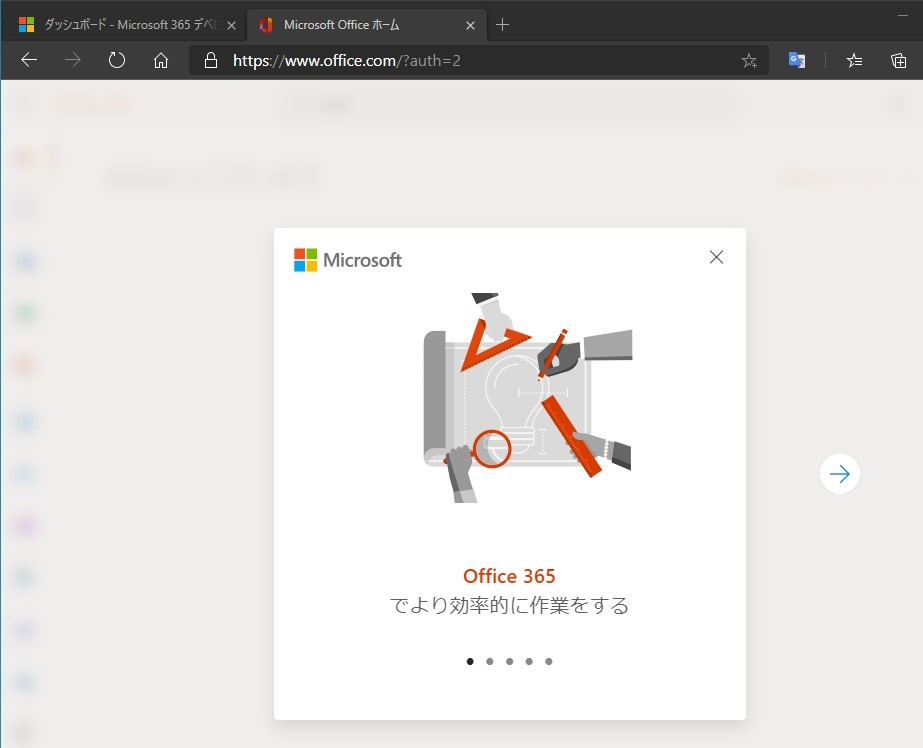
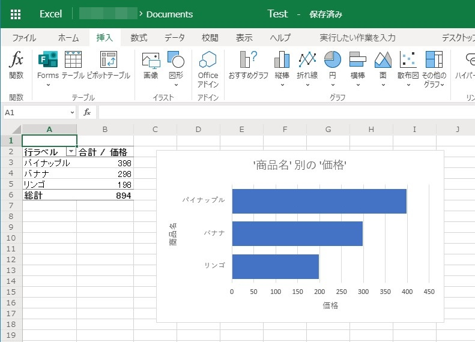

8. Microsoft 365 管理センター( [https://admin.microsoft.com/](https://admin.microsoft.com/) )からライセンス情報を見ると、「Microsoft 365 E5 Developer (Windows および電話会議なし)」となっていることが確認できます。

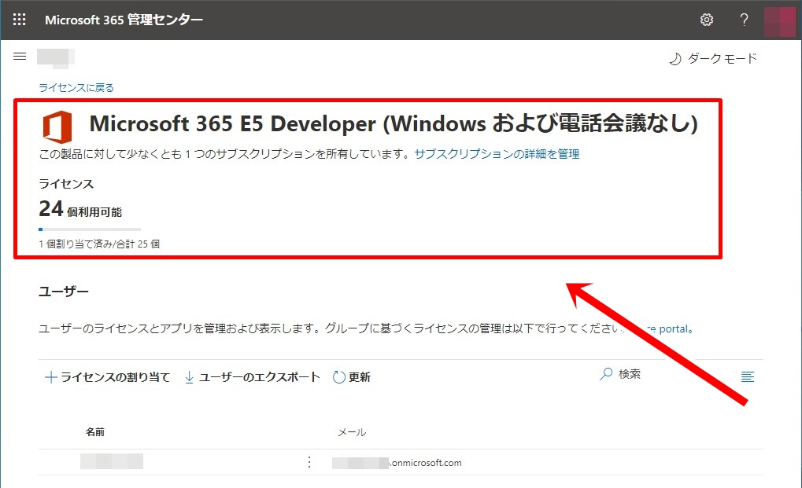

以上でMicrosoft 365 開発者プログラムの登録とサブスクリプションのセットアップは完了となります。

## 関連Webサイト

1. [Microsoft 365 開発者プログラムに参加する | Microsoft Docs](https://docs.microsoft.com/ja-jp/office/developer-program/microsoft-365-developer-program?WT.mc_id=M365-MVP-4029057)
1. [Microsoft 365 開発者 サブスクリプションを設定する | Microsoft Docs](https://docs.microsoft.com/ja-jp/office/developer-program/microsoft-365-developer-program-get-started?WT.mc_id=M365-MVP-4029057)
1. [開発者サブスクリプションを使用して Microsoft 365 ソリューションを構築する | Microsoft Docs](https://docs.microsoft.com/ja-jp/office/developer-program/build-microsoft-365-solutions?WT.mc_id=M365-MVP-4029057)
1. [Microsoft 365 開発者プログラム サブスクリプションでサンプル データ パックを使用する | Microsoft Docs](https://docs.microsoft.com/ja-jp/office/developer-program/install-sample-packs?WT.mc_id=M365-MVP-4029057)
1. [Microsoft 365 開発者プログラム サブスクリプションの有効期限と更新 | Microsoft Docs](https://docs.microsoft.com/ja-jp/office/developer-program/subscription-expiration-and-renewal?WT.mc_id=M365-MVP-4029057)
1. [Microsoft 365 開発者プログラムの FAQ | Microsoft Docs](https://docs.microsoft.com/ja-jp/office/developer-program/microsoft-365-developer-program-faq?WT.mc_id=M365-MVP-4029057)
1. [Office 365 開発者プログラムとは、またどうして期限切れになったのか | いつも隣にITのお仕事](https://tonari-it.com/office-365-developer-program-expired/)